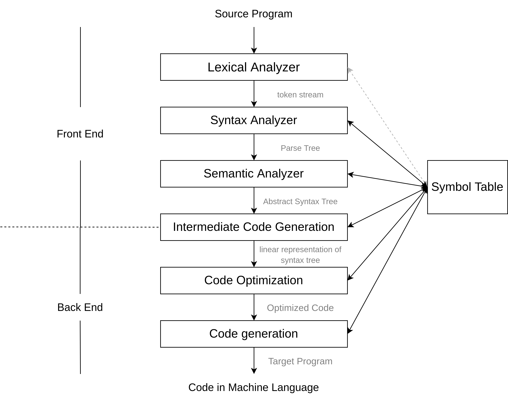

MiniJava Compiler
======

A Mini-Java Compiler Practice.

# What is Mini-Java?

> MiniJava is a subset of Java. The meaning of a MiniJava program is given by its meaning as a Java program.  

> Overloading is not allowed in MiniJava. The MiniJava statement `System.out.println( ... );` can only print integers. The MiniJava expression `e.length` only applies to expressions of type `int []`.

# Gammar

1. [BNF for MiniJava](https://www.cambridge.org/us/features/052182060X/grammar.html)
2. [BNF for MiniJava](https://web.cs.ucla.edu/classes/spring11/cs132/cs132/mj/minijava.html)

# Requirements

* Linux
* CMake
* build-essential
* graphviz
* flex
* bison

# Compiler Phases

<div align="center">
    
</div>

# Usage

``` shell
$ mkdir build/ && cd build/
$ cmake ..
$ make  # or cmake --build .
$ ./compiler <file_path>  # e.g. "../resource/examples/xxx.java"
$ sh graph.sh # args: [ast] [st]
$ make clean
$ cd .. && rm -rf build/
```

# Bug

* Make sure to leave a space after the minus sign, otherwise it will be recognized as a negative sign. (Caused by insufficient regular expressions in the flex file)
  ``` Java
  1-1 // error, recognized as 1 and -1
  1 - 1 // recognized as the subtraction
  ```

# LICENSE

GNU GPL v3

