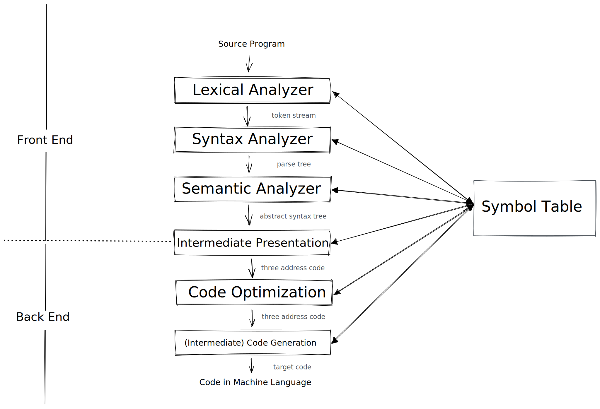

MiniJava Compiler
======

A Mini-Java Compiler Practice.

# What is Mini-Java?

> MiniJava is a subset of Java. The meaning of a MiniJava program is given by its meaning as a Java program.  

> Overloading is not allowed in MiniJava. The MiniJava statement `System.out.println( ... );` can only print integers. The MiniJava expression `e.length` only applies to expressions of type `int []`.

# Gammar

1. [BNF for MiniJava](https://www.cambridge.org/us/features/052182060X/grammar.html)
2. [BNF for MiniJava](https://web.cs.ucla.edu/classes/spring11/cs132/cs132/mj/minijava.html)

# Environments

* Linux (Ubuntu 20.04 LTS)
* CMake 3.16.3
* g++ 9.3.0 (build-essential)
* graphviz 2.43.0
* flex 2.6.4
* Bison 3.5.1

# Compiler Phases

<div align="center">
    
</div>

# File structure

* `include/` : C++ header files
* `resource/`
  * `examples/` : files for testing lexical analysis and syntax analysis
  * `tests/` : files used for back-end stage
  * `valid/` : files for testing semantic analysis
* `src/` : C++ source files

# Usage

``` shell
$ mkdir build/ && cd build/
$ cmake ..
$ make  # or cmake --build .
$ ./compiler <file_path>  # e.g. "../resource/examples/xxx.java"
$ sh graph.sh # args: [ast] [st]
$ make clean
$ cd .. && rm -rf build/
```

# Flaws

* Mix use of raw pointers and smart pointers.
* Math operations only support non-negative integer literals.

# LICENSE

GNU GPL v3

