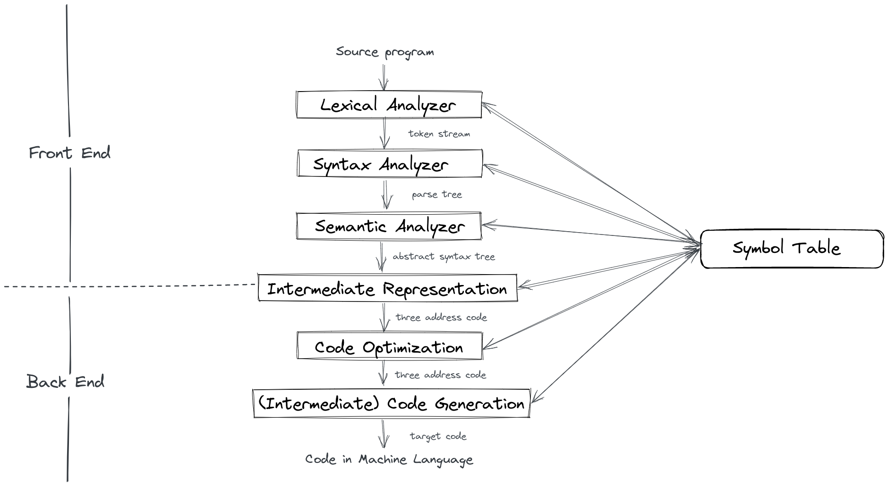

Yet Another Mini-Java Compiler
======

A compiler practice.

# What is Mini-Java?

> MiniJava is a subset of Java. The meaning of a MiniJava program is given by its meaning as a Java program.  

> Overloading is not allowed in MiniJava. The MiniJava statement `System.out.println( ... );` can only print integers. The MiniJava expression `e.length` only applies to expressions of type `int []`.

> There is no `for` loop or `do {} while ()` in MiniJava, `if` statement must be followed by `else` statement, etc... Please refer to the _Grammar_ section below for the detailed grammar.

# Grammar

* [BNF for MiniJava](https://www.cambridge.org/us/features/052182060X/grammar.html)
* [BNF for MiniJava](https://web.cs.ucla.edu/classes/spring11/cs132/cs132/mj/minijava.html)

# Environments

* Ubuntu 20.04 LTS x86_64
* CMake 3.16.3
* g++ 9.3.0
* Graphviz 2.43.0
* flex 2.6.4
* Bison 3.5.1

# Compiler Phases

<div align="center">
    
</div>

# File structure

* `include/` : header files
* `resource/`
  * `examples/` : files used for testing lexical & syntax analysis
  * `tests/` : files used for back-end stage
  * `valid/` : files used for testing semantic analysis
* `src/` : source files

# Usage

``` shell
$ mkdir build/ && cd build/
$ cmake ..
$ make  # or cmake --build .
$ ./compiler <file_path>  # e.g. "../resource/examples/factorial.java"
$ sh graph.sh
$ make clean
$ cd .. && rm -rf build/
```

# LICENSE

GNU GPL v3

